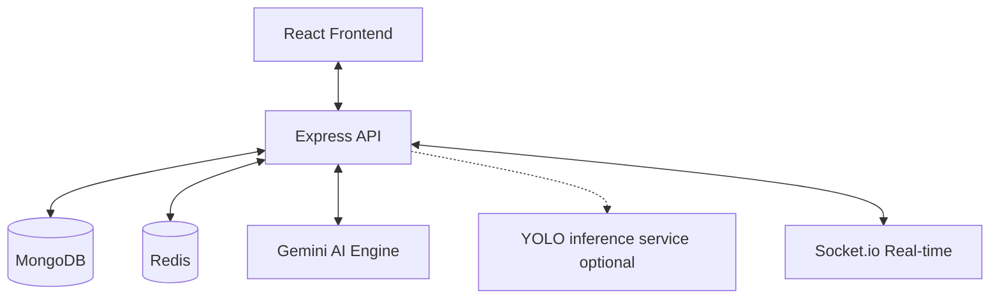

# ♻️ EcoCycle — Smart Waste Management Community

EcoCycle is a full-stack (MERN) platform that leverages **Artificial Intelligence** to revolutionize urban waste management. By combining Image Recognition, Real-time Gamification, and Social Networking, EcoCycle incentivizes citizens to correctly classify and dispose of waste, building a cleaner future through community action.

---

## 🚀 Quick Links
- **Live Platform**: [https://eco-cycle-client-red.vercel.app](https://eco-cycle-client-red.vercel.app)
- **GitHub Repository**: [https://github.com/Aalvee-Aarham/eco-cycle](https://github.com/Aalvee-Aarham/eco-cycle)

---

## 🏗️ Technical Architecture

EcoCycle is built on a service-oriented architecture designed for high throughput and data integrity.

### **The Stack**
- **Frontend**: React 18 (Vite) with **Tailwind CSS** for a premium UI and **Framer Motion** for micro-animations.
- **Backend**: Node.js & Express with a dedicated **Service Layer** pattern to separate business logic from API routing.
- **Database**: MongoDB (Mongoose) for document storage and **Redis** for non-blocking caching of leaderboards and fraud detection windows.
- **AI Engine**: 
  - **Google Gemini 2.0 Flash**: Primary multimodal AI for rapid image classification and intent-checking.
  - **YOLOv10 (Custom Trained)**: Included as an optional local microservice (`yolo-garbage-service`). We trained a custom YOLOv10 model on our proprietary dataset and converted it to **ONNX Runtime** to enable ultra-fast, lightweight CPU inference (<1.5GB Docker footprint vs 6GB PyTorch). Run it locally or deploy it to Railway and set `CLASSIFIER=yolo` on the Node server.

### **System Diagram**


---

## 🧠 Core Technical Workflows

### **1. AI Classification Pipeline**
When a user uploads an image, the system triggers a prioritized classification flow:
1.  **Image Pre-processing**: Sharp is used to generate a **Perceptual Hash (pHash)** of the image.
2.  **Fraud Check**: The system checks the last 60 minutes of the user's history in Redis to ensure the same image isn't being harvested for points (Hamiltonian distance check).
3.  **Adaptive AI**: The `AdapterFactory` routes the image to the primary classifier (Gemini). If the API is unavailable, the system **gracefully fails over** to a secondary or Mock classifier to ensure the user experience isn't interrupted.
4.  **Confidence Routing**: 
    - **High Confidence (≥ 0.72)**: Direct reward awarding.
    - **Low Confidence**: Routed to the **Dispute Queue** for moderator review.

### **2. Submission State Machine**
To ensure data integrity, every waste submission follows a strict state machine:
`PENDING` → `CLASSIFIED` → `AWAITING_REWARD` → `REWARDED` → `REDEEMED`

Invalid transitions (e.g., trying to reward a flagged or pending item) are blocked at the model level, preventing database corruption or point exploitation.

### **3. Role-Based Access Control (RBAC)**
The platform implements a tiered hierarchy:
- **Citizen (Lvl 1)**: Can upload, follow users, and view the feed.
- **Moderator (Lvl 2)**: All Citizen perks + access to the Dispute Queue and basic Audit Views.
- **Administrator (Lvl 3)**: Full system control, including System Configuration (tuning AI thresholds) and full Audit Trail access.

---

## 🛡️ Security & Governance

- **Synchronous Audit Logging**: Every critical event (Logins, State Changes, Account Updates) is written synchronously to the Audit Log. If a log write fails, the parent operation is aborted—guaranteeing that no action is ever unrecorded.
- **Idempotency Protection**: Every submission requires a unique `Idempotency-Key` header, preventing duplicate entries from network retries or double-clicks.
- **JWT Authentication**: Secure, stateless user sessions with configurable expiration.

---

## 👤 Test the Platform

Run `npm run seed` to populate your local database with **60+ community submissions**, follower networks, and the following accounts:

| Role            | Email                         | Password          |
|-----------------|-------------------------------|-------------------|
| **Citizen**     | `citizen@demo.ecocycle.app`   | `DemoCitizen1!`   |
| **Moderator**   | `moderator@demo.ecocycle.app` | `DemoModerator1!` |
| **Administrator** | `admin@demo.ecocycle.app`     | `DemoAdmin1!`     |

---

## ⚙️ Development Setup

```bash
# 1. Clone & Install
npm install

# 2. Environment (See .env.example)
# Port: 5001 (Server), 5173 (Client)
# MONGO_URI, GEMINI_API_KEY required.

# 3. Seed & Run
npm run seed
npm run dev
```

---

---
*Developed by Team-delelu for the Aust cse carnival 7.0 - Hackathon. 🌍*

